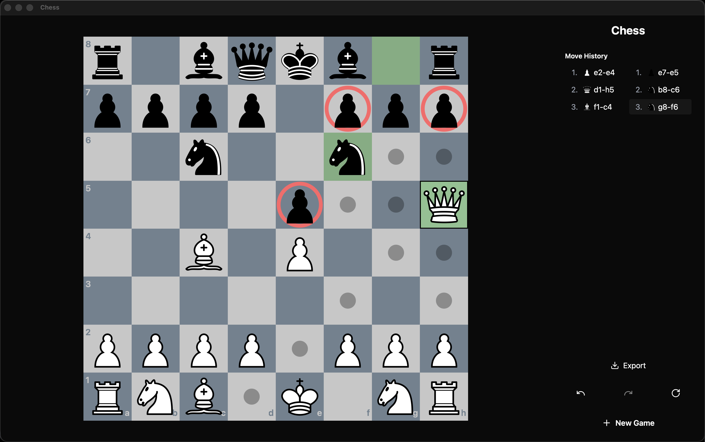
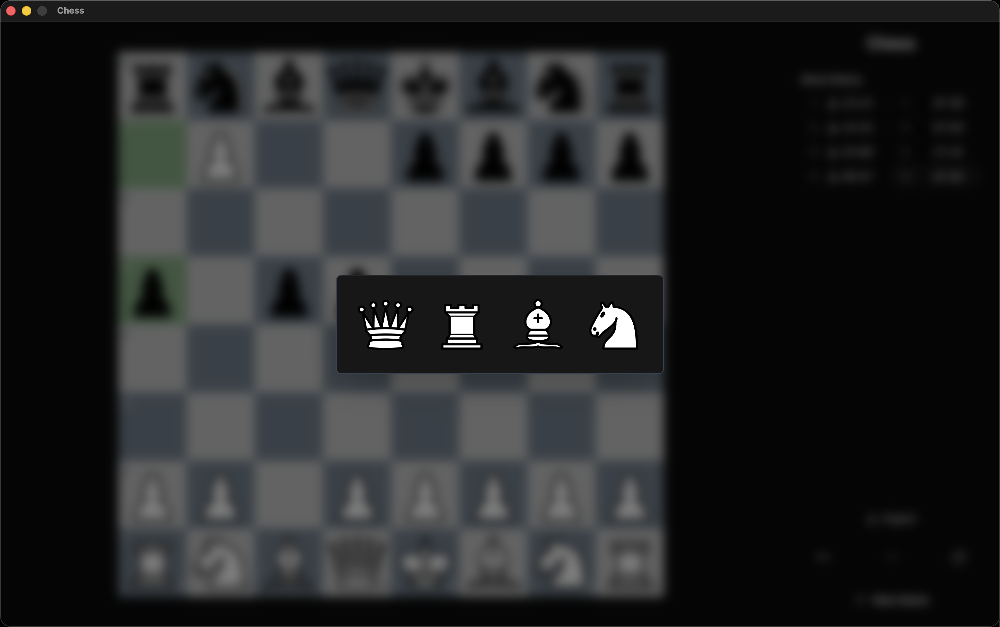
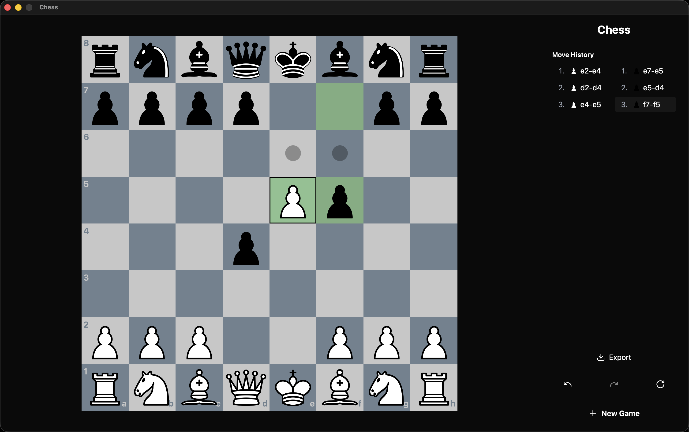
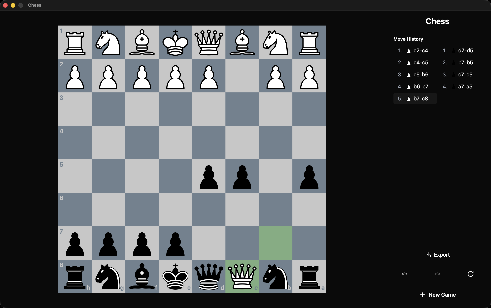

# Chess

A chess game application written with Go and React, using Wails.

## Screenshots

<div align="center">
  
  
  
  
  
</div>

## Features

### Chess Engine

- Bitboard based move generation with legal move validation
- Special moves: castling, en passant, pawn promotion
- Check, checkmate, stalemate detection
- Draw conditions:
    1. Fifty-move rule
    2. Threefold repetition
    3. Insufficient material

### UI

- Drag-and-drop & Click-to-move piece movement
- Visual feedback for:
    1. Legal moves
    2. Check
    3. Last move highlighting
    4. Selected piece highlighting
    5. Promotion selection
    6. Checkmate and draws
- Mark squares with right click and draw arrows by holding right click to another square
- Sidebar includes:
    1. Move history and jumping to a move by clicking
    2. Undo/Redo with keyboard shortcuts left arrow and right arrow
    3. Flipping board orientation
    4. Exporting current board position to FEN
    5. New game button

## Prerequisites

- [Go](https://golang.org/dl/) 1.21+
- [Node.js](https://nodejs.org/) 18+
- [Wails](https://wails.io/docs/gettingstarted/installation) v2
- [Task](https://taskfile.dev/) (optional, for build commands)

## Installation
1. Clone the repository:
```bash
git clone 
cd chess
```

2. Install frontend dependencies:
```bash
cd internal/ui
pnpm install
cd ../..
```

## Development

Run the application in development mode:
```bash
task dev
# or
wails dev
```

### Platform-Specific Builds

**Windows (amd64):**
```bash
task build:windows
```

**macOS (Universal - Intel + Apple Silicon):**
```bash
task build:macos
```

**macOS (Intel only):**
```bash
task build:macos:amd64
```

**macOS (Apple Silicon only):**
```bash
task build:macos:arm64
```

**Linux (amd64):**
```bash
task build:linux
```

### Build All Platforms
```bash
task build:all
```

## Technologies

**Backend:**
- Go 1.21+
- Wails v2
- Custom bitboard chess engine

**Frontend:**
- React 18
- TypeScript
- Tailwind CSS v4
- @dnd-kit (drag and drop)
- Lucide React (icons)
